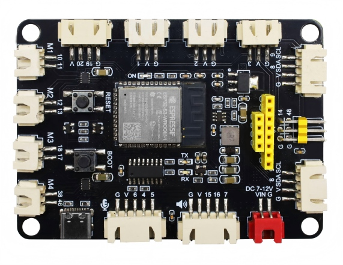
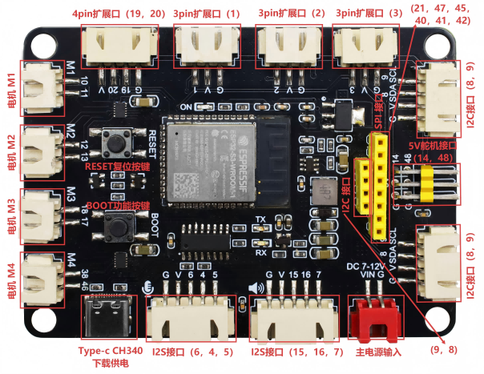

# MB0196 S3 AI rover 开发板



## 1. 引言

MB0196 S3 AI rover采用黑色环保单面贴片PCB，基材为FR4黑油白字板，板尺寸88×64×1.6mm，采用无铅喷锡工艺。主控搭载ESP32-S3-WROOM-1-N16R8模组，拥有16MB Flash以及8MB PSRAM，内置成熟的电源方案、双DRV8835四路电机驱动、丰富外设接口，涵盖I2S音频、双屏幕接口（SPI与I2C）、超声波、舵机扩展等资源，适配AI语音小车、WiFi遥控机器人、教学可编程底盘等诸多开发场景，板上同时预留复位按键、BOOT功能按键方便调试与配网。

## 2. 参数

### 2.1 主控参数

- 主控芯片：ESP32-S3-WROOM-1-N16R8，双核Xtensa LX7，主频最高240MHz
- 存储空间：16MB Flash + 8MB PSRAM
- 无线能力：2.4GHz WiFi、BLE5.0蓝牙

### 2.2 电源参数

- VIN：7~12V直流，作为整机以及四路电机驱动的主供电
- VCC_3V3：AMS1117-3.3稳压输出，最大输出电流900mA，绝大多数扩展外设统一采用该路供电
- VCC_5V：RT6212AHGJ6F DC-DC降压输出，最大持续电流2A，仅专门供给两路舵机接口
- 下载通路：CH340C USB转串口，Type-C接口完成5V供电以及程序下载

### 2.3 板载驱动与外设参数

- 电机驱动：2颗DRV8835，最大单路输出1.5A，实现四轮独立驱动
- 屏幕：板载双屏幕接口——7针LCD端口（SPI接口）与4针I2C屏幕端口，排线兼容GVCA、GVAC两类排布形式
- 音频：全套I2S硬件，麦克风输入搭配功放级喇叭输出

### 2.4 无线与安全特性

- **Wi-Fi**：支持IEEE802.11b/g/n协议，2.4GHz频带20/40MHz频宽，1T1R模式速率高达150Mbps，支持Station、SoftAP及混杂模式
- **蓝牙**：低功耗蓝牙5.0，支持Bluetooth Mesh，发射功率最高20dBm，速率支持125Kbps至2Mbps
- **安全机制**：支持安全启动、Flash加密，内置AES-128/256、SHA、RSA硬件加密加速器及随机数生成器
- **功耗管理**：支持Active、Modem-sleep、Light-sleep、Deep-sleep四种模式，Deep-sleep模式下功耗低至7µA

## 3. 工作原理

1. **电源链路**：外部电源存在两种接入路径，一是Type-C输入5V，满足轻负载主控下载、低功耗外设工作；二是VIN接入7~12V大功率电源，给DRV8835电机驱动供电，再经由RT6212、AMS1117两路稳压分别输出5V、3.3V，给舵机、各类传感器分区供电，规避供电互相干扰。

2. **运动控制**：ESP32-S3输出方向电平信号以及PWM调速信号给到DRV8835，由驱动芯片放大电流去驱动四轮直流电机，达成前进、后退、原地转向、调速运动。两路独立IO输出舵机PWM信号，板载专属5V供电保障舵机扭矩稳定。

3. **多媒体链路**：I2S总线完成麦克风音频采集、喇叭音频回放；SPI总线与I2C总线分别驱动两种屏幕。

4. **交互调试**：BOOT按键可被配置实现语音唤醒、模式切换等功能，RST复位按键实现整机硬重启。

## 4. 外设端口



| 端口类型 | 端口/功能 | 引脚/接口 |
| :--- | :--- | :--- |
| 电机驱动 | 电机端口 1 | DIR=GPIO17，PWM=GPIO18 |
| 电机驱动 | 电机端口 2 | DIR=GPIO46，PWM=GPIO38 |
| 电机驱动 | 电机端口 3 | DIR=GPIO12，PWM=GPIO13 |
| 电机驱动 | 电机端口 4 | DIR=GPIO10，PWM=GPIO11 |
| 舵机 | 舵机通道 1 | SIG=GPIO14（VCC_5V） |
| 舵机 | 舵机通道 2 | SIG=GPIO48（VCC_5V） |
| SPI屏幕 | 7针LCD端口 | SCLK=GPIO21，MOSI=GPIO47，CS=GPIO41，DC=GPIO40，RST=GPIO45 |
| I2C屏幕 | 4针I2C屏幕端口 | SCL=GPIO9，SDA=GPIO8 |
| 超声波 | 超声波端口 | GPIO20，GPIO19 |
| I2S音频 | 麦克风输入 | BCLK=GPIO5，WS=GPIO4，DIN=GPIO6 |
| I2S音频 | 喇叭功放输出 | BCLK=GPIO15，WS=GPIO16，DOUT=GPIO7 |
| 扩展排座 | 多规格通用扩展 | 3Pin/4Pin/5Pin XH 2.54mm接口，引出GPIO（含I2C：SDA=GPIO8，SCL=GPIO9） |
| 按键 | BOOT按键 | GPIO0 |
| 按键 | RST按键 | 硬件复位 |
| 供电 | Type-C端口 | 5V输入，程序下载 |
| 供电 | VIN电源座 | 7~12V直流输入 |

## 5. 布线

### 5.1 电源布线要点


## 6. 环境与代码

### 6.1 开发环境搭建


1. **安装Arduino IDE**：请参考 [Arduino IDE 安装教程](https://www.keyesrobot.cn/projects/Arduino)，教程中包含了ESP32芯片包的安装方法（版本可选择最新版），此处不再赘述。

2. **开发板选择**：打开Arduino IDE，依次点击 `工具` → `开发板` → `esp32` → `ESP32S3 Dev Module`。

3. **端口选择**：使用Type-C数据线连接开发板与电脑，点击 `工具` → `端口`，选择新增的串口号（如无新增串口，请检查是否已[安装CH340驱动](https://www.keyesrobot.cn/projects/Arduino)或更换USB数据线）。


4. **烧录程序**：将示例程序复制到IDE中，点击上传按钮即可完成烧录。

### 6.2 示例：四路电机测试

```arduino
#include <ESP32PWM.h>
ESP32PWM pwm_lf, pwm_lb, pwm_rf, pwm_rb;
int lf_dir = 17, lf_pwm = 18;
int lb_dir = 46, lb_pwm = 38;
int rf_dir = 12, rf_pwm = 13;
int rb_dir = 10, rb_pwm = 11;
const int speed = 100;

void setup(){
  Serial.begin(115200);
  pinMode(lf_dir, OUTPUT);
  pinMode(lb_dir, OUTPUT);
  pinMode(rf_dir, OUTPUT);
  pinMode(rb_dir, OUTPUT);
  pwm_lf.attachPin(lf_pwm, 490, 8);
  pwm_lb.attachPin(lb_pwm, 490, 8);
  pwm_rf.attachPin(rf_pwm, 490, 8);
  pwm_rb.attachPin(rb_pwm, 490, 8);
  Serial.println("电机初始化完成");
}

// 小车前进
void forward(int sp){
  digitalWrite(lf_dir, HIGH);
  digitalWrite(lb_dir, HIGH);
  digitalWrite(rf_dir, HIGH);
  digitalWrite(rb_dir, HIGH);
  pwm_lf.write(sp);
  pwm_lb.write(sp);
  pwm_rf.write(sp);
  pwm_rb.write(sp);
}

// 小车后退
void back(int sp){
  digitalWrite(lf_dir, LOW);
  digitalWrite(lb_dir, LOW);
  digitalWrite(rf_dir, LOW);
  digitalWrite(rb_dir, LOW);
  pwm_lf.write(sp);
  pwm_lb.write(sp);
  pwm_rf.write(sp);
  pwm_rb.write(sp);
}

// 原地左转
void turnLeft(int sp){
  digitalWrite(lf_dir, LOW);
  digitalWrite(lb_dir, LOW);
  digitalWrite(rf_dir, HIGH);
  digitalWrite(rb_dir, HIGH);
  pwm_lf.write(sp);
  pwm_lb.write(sp);
  pwm_rf.write(sp);
  pwm_rb.write(sp);
}

// 原地右转
void turnRight(int sp){
  digitalWrite(lf_dir, HIGH);
  digitalWrite(lb_dir, HIGH);
  digitalWrite(rf_dir, LOW);
  digitalWrite(rb_dir, LOW);
  pwm_lf.write(sp);
  pwm_lb.write(sp);
  pwm_rf.write(sp);
  pwm_rb.write(sp);
}

// 电机停止
void stopCar(){
  pwm_lf.write(0);
  pwm_lb.write(0);
  pwm_rf.write(0);
  pwm_rb.write(0);
}

void loop(){
  forward(speed);
  delay(2000);
  turnRight(speed);
  delay(2000);
  back(speed);
  delay(2000);
  turnLeft(speed);
  delay(2000);
  stopCar();
  delay(1000);
}
```

## 7. 测试结果


烧入上述电机代码，小车会周期性依次完成前进2s、右转2s、后退2s、左转2s、停顿1s这一套动作，四轮启停顺滑，调速区间0~255调节效果明显；调换单组电机接线就可以修正反转异常的问题。


## 8. 常见异常结论排查

1. 烧录失败：排查数据线是否仅支持充电、重装CH340驱动；

2. 电机不动：检查VIN大功率电源是否接好；

3. 外设烧坏：确认除两路舵机以外，所有外接传感器统一使用3.3V供电；

4. 屏幕显示异常：排线排布进行适配排查。